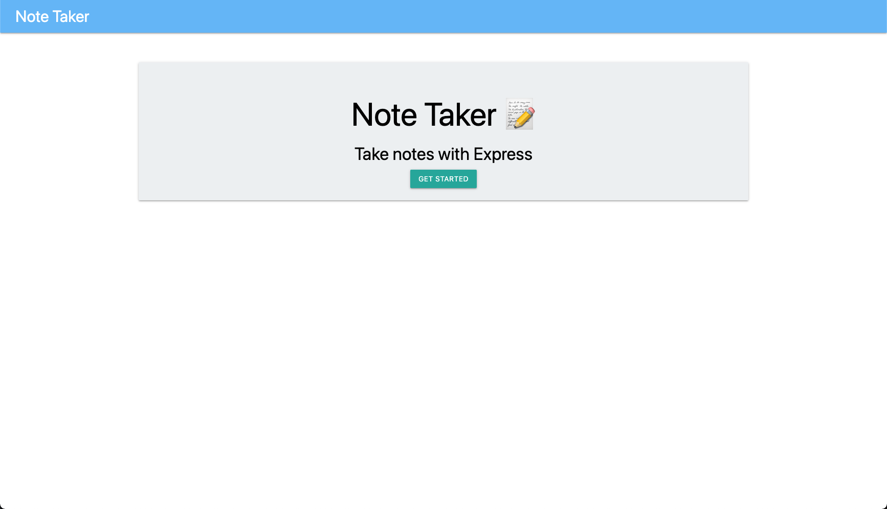

# note-taker

## Table of Contents

1. [Description](#description)
1. [Usage](#usage)
1. [User Story](#user-story)
1. [Acceptance Criteria](#acceptance-criteria)
1. [Licenses](#licenses)
1. [Technology](#technology)
1. [Mock-up](#mock-up)
1. [Support](#support)
   - [Installation](#installation)
   - [Questions](#questions)

## Description
Create and save notes that you want to get to across multiple devices.

## Usage
You can access the app here: [https://enigmatic-sands-50007.herokuapp.com/](https://enigmatic-sands-50007.herokuapp.com/).

## User Story
>**AS A(N)** small business owner<br>
I **WANT** to be able to write and save notes<br>
**SO THAT** I can organize my thoughts and keep track of tasks I need to complete.


## Acceptance Criteria
**GIVEN** a note-taking application

>**WHEN** I open the Note Taker<br>
**THEN** I am presented with a landing page with a link to a notes page

>**WHEN** I click on the link to the notes page<br>
**THEN** I am presented with a page with existing notes listed in the left-hand column, plus empty fields to enter a new note title and the note’s text in the right-hand column

>**WHEN** I enter a new note title and the note’s text<br>
**THEN** a Save icon appears in the navigation at the top of the page

>**WHEN** I click on the Save icon<br>
**THEN** the new note I have entered is saved and appears in the left-hand column with the other existing notes

>**WHEN** I click on an existing note in the list in the left-hand column<br>
**THEN** that note appears in the right-hand column

>**WHEN** I click on the Write icon in the navigation at the top of the page<br>
**THEN** I am presented with empty fields to enter a new note title and the note’s text in the right-hand column

## Licenses
[](https://github.com/avidrunner87/team-profile-generator/blob/main/LICENSE.md)

## Technology


## Mock-up
The following picture shows the website appearance and capabilities:

<br>

<br>


## Support
### Installation
To fork this code to further improve the website, please follow these directions:

1. In Github fork the repository.
1. Clone the repository to your local computer.

_This assumes that you have setup your own SSH keys to connect with Github._

1. Before running the note-taker, please ensure all the necessary node modules are installed:

```
npm install
```

You can run the express server locally running the following command:
```
npm start
```

### Questions
If you have any questions please reach out to me via [Github](https://github.com/avidrunner87) or via [email](mailto:andrew.ronchetto@me.com).
